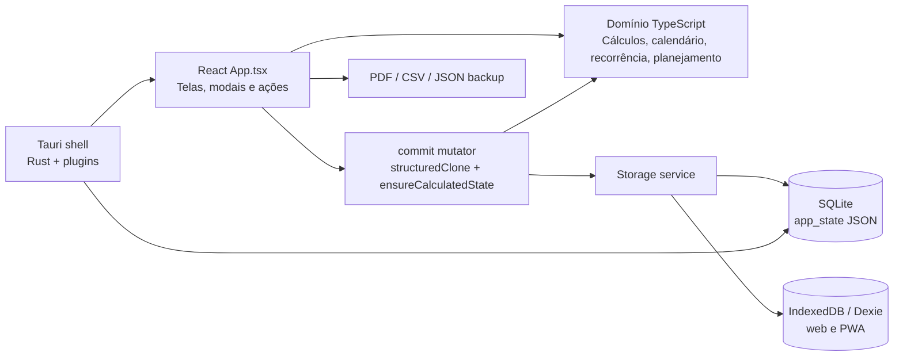

# ZFinance / HomeCoin — Architecture and AI Context

> Documento de contexto técnico para fornecer a ChatGPT, Claude, Codex ou outro assistente antes de pedir alterações no projeto.
>
> Atualizado em: 4 de agosto de 2026  
> Projeto local: `C:\Users\Camilo\Desktop\ZFinance`  
> Nome do produto na interface: **HomeCoin**

## 1. Como usar este documento

Ao iniciar um novo chat sobre o programa, envie este arquivo inteiro e acrescente o pedido específico. A IA deve tratar este documento como um mapa do código atual, mas deve sempre confirmar detalhes sensíveis diretamente nos arquivos antes de editar.

Orientações importantes para qualquer IA que trabalhe no projeto:

1. Este é um aplicativo desktop Tauri, não um serviço web com backend remoto.
2. Preserve o funcionamento offline e local. Não introduza cloud, autenticação ou APIs externas sem autorização explícita.
3. Valores monetários são armazenados como inteiros em centavos. Nunca salve dinheiro como ponto flutuante.
4. Datas financeiras são strings locais no formato `YYYY-MM-DD`. Timestamps de auditoria usam ISO completo.
5. Antes de mudar cálculos, entenda a diferença entre saldo atual realizado, receitas menos contas e saldo projetado.
6. Recorrências são expandidas virtualmente para as telas. Não crie uma transação física para cada ocorrência futura sem necessidade.
7. Use as variáveis CSS existentes e mantenha a paleta sage/cream/terracotta, sem texto preto puro.
8. Depois de qualquer alteração, execute `pnpm typecheck`, `pnpm lint`, `pnpm test` e, quando afetar o desktop, `pnpm build`.

## 2. Visão geral do produto

HomeCoin é um planejador financeiro doméstico, privado e offline-first. Ele foi pensado principalmente para um casal acompanhar:

- saldo atual das contas;
- receitas e contas de cada semana;
- projeção do saldo que passa de uma semana para a seguinte;
- itens recorrentes;
- contas a pagar ou receber;
- metas e contribuições de poupança;
- calendário mensal;
- relatórios semanais e mensais imprimíveis;
- exportação em PDF e CSV;
- backup e restauração local em JSON.

Não existe conta de usuário, servidor, sincronização em nuvem ou conexão obrigatória com a internet.

## 3. Stack atual

| Camada | Tecnologia | Uso |
|---|---|---|
| Interface | React 19 + TypeScript estrito | SPA desktop e preview web |
| Build web | Vite 8 | Desenvolvimento, bundle e testes |
| Desktop | Tauri 2 | Janela nativa e instalador Windows |
| Código nativo | Rust | Inicialização do Tauri e plugins |
| Persistência desktop | SQLite via `@tauri-apps/plugin-sql` | Estado local e tabelas auxiliares |
| Persistência web | IndexedDB via Dexie | Fonte local do browser/PWA; localStorage é apenas migração/recuperação temporária |
| PWA | `vite-plugin-pwa` + Workbox | Manifest, app shell offline, instalação e atualização controlada |
| Datas | `date-fns` + helpers próprios | Semanas, meses, recorrências e intervalos |
| Gráficos | Recharts | Dashboard, savings e relatórios em tela |
| Drag and drop | `@dnd-kit/core` | Planner mensal interativo com mouse e teclado |
| PDF | jsPDF | Relatórios exportados em PDF |
| CSV | Papa Parse | Exportação e infraestrutura de importação |
| Ícones | lucide-react | Ícones da interface |
| CSS | Tailwind importado + CSS próprio | Utilities e componentes visuais customizados |
| Testes | Vitest + Testing Library + jsdom | Domínio e fluxos principais da interface |

Dependências de React Query e React Hook Form existem no projeto, mas o fluxo principal atual usa estado React e handlers próprios.

## 4. Arquitetura em alto nível



Fluxo normal de alteração:

```text
clique/formulário
  -> handler em App.tsx
  -> commit(mutator)
  -> structuredClone do AppState atual
  -> mutação imutável
  -> ensureCalculatedState()
  -> saveState()
  -> SQLite ou localStorage
  -> setState()
  -> React renderiza novamente
```

## 5. Estrutura principal de arquivos

```text
ZFinance/
├─ index.html                     # carrega /src/main.tsx
├─ package.json                   # scripts e dependências
├─ vite.config.ts                 # Vite, React, Tailwind e Vitest
├─ tsconfig.json                  # TypeScript strict
├─ src/
│  ├─ main.tsx                    # ponto de entrada React ativo
│  ├─ style.css                   # design system, layouts, responsividade e impressão
│  ├─ app/
│  │  ├─ App.tsx                  # shell, views, modais e handlers principais
│  │  └─ MonthlyPlanner.tsx       # visual compartilhado pelo Planner e Reports
│  ├─ database/
│  │  └─ migrations.ts            # schema SQLite e DATABASE_FILE
│  ├─ persistence/                # contrato e adapters SQLite/IndexedDB
│  ├─ sync/                       # contratos, fila e providers desativados/mock
│  ├─ pwa/                        # instalação e atualização PWA
│  ├─ components/feedback/        # status de persistência/offline
│  ├─ services/
│  │  └─ storage.ts               # facade compatível e status load/save
│  ├─ domain/
│  │  ├─ model.ts                 # tipos e AppState
│  │  ├─ seed.ts                  # estado vazio e dados de demonstração
│  │  ├─ calculations.ts          # saldos, forecast, dashboard, budgets e summaries
│  │  ├─ home.ts                  # itens visíveis, recorrências, semana, mês e ranges
│  │  ├─ cashflow.ts              # saldo disponível e projeção corrida
│  │  ├─ planning.ts              # folhas semanais/mensais e savings
│  │  ├─ planner-actions.ts       # movimentos, overrides, valores e conclusão no Planner
│  │  ├─ deduplication.ts         # proteção e limpeza de duplicatas
│  │  ├─ backup.ts                # JSON de backup e SHA-256
│  │  └─ importing.ts             # parsing CSV/paste e duplicatas
│  ├─ lib/
│  │  ├─ date.ts                  # helpers de datas ISO locais
│  │  └─ format.ts                # moeda, datas e percentuais
│  └─ tests/                      # 42 testes atuais em 8 arquivos
├─ src-tauri/
│  ├─ src/lib.rs                  # builder Tauri e plugins
│  ├─ tauri.conf.json             # janela, bundle e metadados
│  ├─ capabilities/default.json   # permissões SQL e backup em Documents
│  ├─ Cargo.toml                  # dependências Rust
│  └─ icons/                      # ícones do executável/instalador
└─ scripts/
   └─ run-tauri.mjs               # garante Cargo no PATH e executa Tauri
```

`src/main.ts` e `src/counter.ts` são sobras do template inicial do Vite e não são o ponto de entrada ativo. O arquivo ativo é `src/main.tsx`.

## 6. Entrada da aplicação e navegação

`index.html` monta um elemento `#root`. `src/main.tsx` renderiza `<App />` dentro de `React.StrictMode` e importa `src/style.css`.

A aplicação não usa React Router. A navegação é interna, controlada por:

```ts
type SectionKey =
  | 'dashboard'
  | 'planner'
  | 'week'
  | 'calendar'
  | 'recurring'
  | 'bills'
  | 'savings'
  | 'reports'
  | 'settings'
```

`activeSection` decide qual view é renderizada. As seções visíveis são:

| Chave | Nome na interface | Responsabilidade |
|---|---|---|
| `dashboard` | Dashboard | Visão geral, saldo, gráfico, agenda, categorias e atividade recente |
| `planner` | Planner | Ciclos financeiros semanais contínuos, drag/drop, edição e recálculo ao vivo |
| `week` | This Week | Planejamento diário da semana e saldo corrido |
| `calendar` | This Month | Calendário mensal e lista de itens |
| `recurring` | Recurring | Regras recorrentes de receitas e despesas |
| `bills` | Bills | Contas e receitas one-off/recorrentes em uma janela de datas |
| `savings` | Savings | Metas, contribuições e progresso |
| `reports` | Reports | Semana, mês, ano ou range customizado; print/PDF/CSV |
| `settings` | Settings | Tema, privacidade, calendário, moeda, dados, pessoas e categorias |

O sidebar é fixo em desktop. Abaixo de 1024 px ele deixa de ser renderizado e é substituído por navegação inferior móvel com cinco itens: Home, Planner, Bills, Reports e More. More contém This Week, This Month, Recurring, Savings e Settings.

Atalhos globais atuais, ignorados enquanto o foco está em input/textarea/select:

| Atalho | Ação |
|---|---|
| `N` | Abre Add item |
| `G`, depois `D` | Dashboard |
| `G`, depois `P` | Planner |
| `G`, depois `W` | This Week |
| `G`, depois `M` | This Month |
| `G`, depois `R` | Recurring |
| `G`, depois `B` | Bills |
| `G`, depois `S` | Savings |
| `Escape` | Fecha diálogos de exclusão e ações do Planner |
| `Delete`/`Backspace` | Abre confirmação para a linha focada em Bills/Recurring |

## 7. Organização da UI

`src/app/App.tsx` é atualmente um componente monolítico com mais de 3.500 linhas. Ele contém:

- tipos dos drafts e modais;
- componentes pequenos locais como `Button`, `Card`, `Field`, `ModalShell`, `SideDrawer`, `MetricCard`, `EmptyState` e `ItemRow`;
- carregamento e persistência do estado;
- handlers de criação, edição, conclusão, exclusão e undo;
- todas as views principais;
- PDF, CSV e backup;
- onboarding;
- modais e toasts.

Isto é importante ao planejar mudanças: não presuma que existe uma pasta de componentes por tela. Refatorações devem ser incrementais e manter os testes funcionando.

## 8. Estado e modelo de dados

O agregado central é `AppState`, definido em `src/domain/model.ts`.

Principais coleções:

| Entidade | Função |
|---|---|
| `household` | Nome, moeda, locale, início da semana/mês financeiro |
| `members` | Pessoas do household |
| `accounts` | Contas correntes, joint, cartão, cash, savings, loan etc. |
| `categories` | Categoria, grupo, cor, ícone e estado archived |
| `transactions` | Receitas, despesas, transferências e ajustes |
| `recurringRules` | Regras que geram ocorrências virtuais |
| `budgets` | Orçamentos gerais, por categoria ou pessoa |
| `goals` | Metas de savings e contribuição mensal planejada |
| `tags` | Tags de transações |
| `categorizationRules` | Regras automáticas para imports/transações |
| `imports` / `importRows` | Metadados de importação |
| `attachments` | Referências a comprovantes/arquivos |
| `backups` | Histórico lógico de backups |
| `auditEvents` | Eventos de auditoria |
| `forecastSnapshots` | Snapshots de projeções |
| `settings` | Tema, privacidade, locale, moeda e backup |

Algumas entidades do modelo e tabelas SQLite já existem como infraestrutura, mas ainda não possuem uma tela completa. Exemplos: merchants, attachments, categorization rules, import batches, audit events e forecast snapshots.

### 8.1 Transação

Campos essenciais de `Transaction`:

- `amountCents`: valor positivo inteiro; o sinal é interpretado por `type`;
- `type`: `income`, `expense`, `transfer` ou `adjustment`;
- `transactionDate`, `dueDate`, `paidDate`;
- `status`: `planned`, `pending`, `paid`, `received`, `overdue`, `cancelled`;
- `accountId` e, para transferências, `counterpartyAccountId`;
- `recurrenceRuleId`: liga uma ocorrência/override à regra recorrente;
- `categoryId`, `personId`, `tags`, `notes`;
- `source`: `manual` ou `imported`.

Status considerados realizados:

```text
expense realizada = status paid
income realizada  = status received
```

`planned`, `pending` e `overdue` participam do planejamento, mas não alteram o saldo bancário realizado até serem concluídos.

### 8.2 Regras recorrentes

`RecurringRule` guarda nome, valor, frequência, intervalo, próxima data, conta, categoria, pessoa, flags e data final opcional.

Frequências suportadas pelo domínio:

- weekly;
- fortnightly;
- monthly;
- bimonthly;
- quarterly;
- semiannual;
- yearly;
- custom.

A interface de criação principal expõe atualmente: one-time, weekly, fortnightly, monthly e yearly.

### 8.3 Categorias determinam income ou expense recorrente

Uma regra recorrente é interpretada como receita se a categoria tiver `group` igual a `Income` ou `Receitas`. Qualquer outro grupo é tratado como conta/despesa. Ao adicionar categorias novas, preserve esta convenção.

## 9. Persistência local

### 9.1 Desktop Tauri

Banco configurado:

```ts
DATABASE_FILE = 'sqlite:homecoin.db'
```

O SQLite fica na área de dados do aplicativo gerenciada pelo Tauri.

Embora `migrations.ts` crie tabelas normalizadas para todas as entidades, o caminho principal atual persiste o agregado inteiro como JSON na tabela:

```sql
app_state (
  id INTEGER PRIMARY KEY CHECK (id = 1),
  schema_version INTEGER NOT NULL,
  payload TEXT NOT NULL,
  updated_at TEXT NOT NULL
)
```

Portanto, a fonte de verdade funcional atual é `app_state.payload`, não CRUD individual em cada tabela normalizada. Tabelas como `backups`, `audit_events`, `forecast_snapshots` e `settings` também possuem helpers específicos.

Tabelas criadas pela migration v1:

```text
schema_migrations
app_state
household
household_members
financial_accounts
categories
merchants
recurring_rules
budgets
budget_periods
financial_goals
tags
transactions
transaction_splits
transaction_tags
categorization_rules
imports
import_rows
attachments
settings
backups
audit_events
forecast_snapshots
```

Há índices para transações por household/data, categoria e conta, além de índices para categorias, categorization rules, recorrências e metas. Os acessos SQL existentes usam parâmetros (`$1`, `$2`, etc.), não interpolação direta de entrada do usuário.

Existe migração automática do banco legado `sqlite:home-finance.db`: se `homecoin.db` estiver vazio, `loadState()` tenta carregar o `app_state` antigo e salvá-lo no banco novo.

### 9.2 Web e PWA

Fora do runtime Tauri, `WebIndexedDbAppStateRepository` usa o banco Dexie `homecoin-local` com stores `appState`, `syncQueue`, `metadata` e `migrationState`. A chave antiga `homecoin:web-state` é importada somente quando IndexedDB está vazio e válido; permanece temporariamente como espelho de recuperação, nunca como fonte primária.

### 9.3 Inicialização

No primeiro `useEffect` de `App.tsx`:

1. `loadState()` escolhe o repository pelo runtime e tenta recuperar o estado local;
2. sem estado, usa `createBlankState()`;
3. `cleanupOneOffRecurringDuplicates()` remove duplicatas planejadas antigas;
4. `ensureCalculatedState()` recalcula saldos e sincroniza settings;
5. se houve limpeza, o estado é persistido novamente;
6. o React recebe o estado pronto.

Se o carregamento falhar, a aplicação registra o erro e inicia um estado vazio calculado.

## 10. Regras financeiras fundamentais

### 10.1 Dinheiro

Todos os cálculos usam centavos inteiros:

```text
€37,99 -> 3799
€530,00 -> 53000
```

Somente na formatação o valor é dividido por 100. Novos cálculos devem usar `Math.round` ao converter entrada decimal para centavos.

### 10.2 Saldo atual das contas

`recalculateAccountBalances()` faz:

```text
currentBalance = openingBalance
               + incomes recebidas
               - expenses pagas
               +/- transfers por conta
               + adjustments realizados
```

Transações canceladas não afetam nenhum cálculo. Transferências não alteram o saldo consolidado, mas retiram da conta de origem e adicionam à conta de destino.

### 10.3 Receita menos contas

O antigo termo “cash flow” foi substituído nas partes principais por uma descrição mais clara:

```text
Income minus bills = receitas planejadas do período - contas planejadas do período
```

Este número não é necessariamente o saldo bancário. Ele representa apenas o movimento líquido do período.

### 10.4 Saldo disponível e saldo projetado

Existem conceitos relacionados, mas diferentes:

- saldo consolidado: soma do saldo atual de todas as contas;
- saldo spendable: contas não arquivadas dos tipos `current`, `joint`, `cash` e `manual`; se nenhuma existir, usa todas as contas ativas;
- opening balance: saldo carregado no início do período;
- closing balance: saldo após aplicar os movimentos planejados;
- projected closing after savings: saldo final depois da alocação planejada/real de savings.

Fórmula do planner:

```text
week closing before savings
  = week opening balance + week income - week bills

week closing balance
  = week closing before savings - allocated savings

next week opening balance
  = previous week closing balance
```

O valor que sobrou ou faltou passa automaticamente para a semana seguinte.

### 10.5 Contas overdue

Uma conta vencida ainda não paga aparece no planejamento e nos alertas, mas não é subtraída novamente do saldo atual realizado. Ela só altera o saldo realizado quando recebe status `paid`.

### 10.6 Savings

Uma contribuição real para savings é uma `Transaction` do tipo `transfer`:

- sai de uma conta spendable;
- entra em uma conta `savings`;
- possui tag `savings` e normalmente `goal:<goalId>`;
- atualiza o `currentCents` da meta.

No relatório:

```text
planned savings = soma das contribuições mensais das metas,
                  ajustada proporcionalmente ao período

actual savings = transferências concluídas para contas savings no período

savings cash outflow = max(planned savings, actual savings)

after savings = income minus bills - savings cash outflow
```

## 11. Recorrências e ocorrências

As ocorrências futuras não são gravadas antecipadamente como transações comuns. `buildVisibleItems()` expande cada regra recorrente dentro da janela solicitada.

Fluxo:

```text
RecurringRule
  -> expandRecurringDates()
  -> SimpleItem virtual por data
  -> telas/calendário/relatório
```

Se existir uma transação com o mesmo `recurrenceRuleId` e data, ela funciona como ocorrência materializada/override e substitui os dados virtuais.

Ao marcar uma ocorrência recorrente como paga/recebida, o sistema cria uma transação física ligada à regra. Ao editar, o usuário pode escolher:

- somente esta ocorrência;
- toda a série futura.

Editar a série atualiza a `RecurringRule` e remove overrides futuros ainda não concluídos a partir da ocorrência selecionada. Histórico `paid`/`received` é preservado.

## 12. Criação, deduplicação e exclusão

### 12.1 One-time versus recurring

O formulário de Add deve criar exatamente um tipo:

- `once`: cria somente uma `Transaction` planejada;
- qualquer recorrência: cria somente uma `RecurringRule`.

Nunca crie os dois no mesmo clique.

Antes de inserir, o app compara nome normalizado, valor em centavos e data. Duplicatas são ignoradas com toast `Duplicate skipped` e aviso no console.

Na inicialização, `cleanupOneOffRecurringDuplicates()` remove transações one-off planejadas que coincidam com uma regra recorrente. Transações concluídas são sempre preservadas como histórico.

### 12.2 Exclusão de contas

Excluir uma conta/ocorrência usa cancelamento lógico:

- uma transação existente recebe `status: cancelled`;
- uma ocorrência recorrente puramente virtual recebe uma transação tombstone cancelada;
- o tombstone impede que a ocorrência virtual reapareça;
- o toast oferece Undo por 8 segundos.

### 12.3 Exclusão de recorrências

Excluir uma regra recorrente:

- remove a regra;
- remove transações futuras planejadas ligadas a ela;
- mantém transações passadas/concluídas;
- permite Undo pelo toast;
- funciona individualmente e em bulk selection.

## 13. Telas em detalhe

### Dashboard

- saudação dinâmica e data atual;
- card principal de saldo e sparkline de 30 dias;
- receita menos contas da semana;
- próximo payday;
- savings rate;
- gráfico de semanas passadas e futuras;
- alerta se a projeção futura ficar negativa;
- agenda da semana;
- metas de savings;
- donut de categorias;
- últimas oito transações com filtro.

No mobile, o gráfico usa quatro semanas para trás e quatro para frente. Em telas maiores usa oito de cada lado.

### This Week

- navegação Previous/Today/Next;
- receitas, contas e saldo final projetado;
- sete colunas diárias;
- saldo corrido por dia;
- listas separadas de income e bills;
- conclusão Receive/Pay;
- edição de ocorrência ou série;
- impressão da semana.

### This Month

- calendário mensal ou modo lista;
- itens gerados por transações e recorrências;
- totais por dia;
- seleção de dia para detalhes/edição.

### Recurring

- abas Incomes e Expenses;
- criação e edição de regras;
- ativar/pausar;
- duplicar;
- excluir individualmente ou em massa;
- seleção por checkbox.

### Bills

- janela visível aproximada de 90 dias passados até 365 futuros;
- filtros All, To Pay, To Receive e Overdue;
- identifica One-off e Recurring;
- Pay/Receive, Edit e Delete;
- seleção em massa e Mark as paid.

### Savings

- metas ativas;
- target, current, monthly contribution e data alvo;
- contribuição gera transferência real;
- progresso percentual;
- gráfico estimado de savings ao longo de 12 meses.

### Settings

- tema light/dark/system;
- privacy mode;
- início da semana;
- moeda EUR/USD/GBP/BRL;
- export/import de backup JSON;
- carregar household de demonstração;
- gerenciar membros;
- criar e pausar categorias.

## 14. Relatórios

Períodos disponíveis:

- semana;
- mês;
- ano;
- intervalo customizado.

Saídas:

- `window.print()` usando CSS de impressão;
- PDF via jsPDF;
- CSV via Papa Parse.

### 14.1 Planner semanal e mensal

Semana e mês usam `buildPlanningWeeks()`. Cada folha semanal possui sete colunas, uma por dia, com:

- itens e valores do dia;
- income do dia;
- bills do dia;
- income minus bills;
- running balance;
- totais semanais;
- opening balance;
- savings allocation;
- closing balance.

Reports separa dois intervalos:

- `reportRange`: período exato escolhido, usado pelos totais, categorias, savings, CSV e Monthly grand summary;
- `plannerRange`: `reportRange` expandido pelo `expandPlanningRange()` até o começo e o fim de semanas completas, respeitando `settings.weekStartDay`.

O Planner interativo busca itens em `plannerRange`, inclusive dias adjacentes de outro mês. Seu opening balance é calculado no início real da primeira semana e cada closing balance passa para a semana seguinte. O Planner não apresenta um resultado concorrente de mês-calendário: seu resumo é estritamente derivado das `PlanningWeek[]` visíveis.

Os resultados finais possuem nomes e fontes diferentes:

```text
calendarMonthResultCents
  = income de reportRange - expenses de reportRange

plannerCycleClosingBalanceCents
  = closingBalanceCents da última PlanningWeek de plannerRange
```

O segundo valor não deve ser substituído pela projeção limitada ao mês-calendário. No Planner interativo, a navegação mantém ciclos contínuos: o próximo `plannerRange.start` é sempre o dia seguinte ao `plannerRange.end` atual. Reports continua usando o mês-calendário para totais, categorias e CSV.

O componente compartilhado `MonthlyPlannerSummary` exige um modo explícito:

- `mode="planner-cycle"`: mostra somente opening balance da primeira semana, income, bills, income minus bills, savings allocation e closing balance da última semana do ciclo;
- `mode="calendar-report"`: mantém o resumo mensal-calendário de Reports, com categorias e comparação mensal.

O helper `buildPlannerCycleSummary(planningWeeks)` é a fonte única do resumo interativo. Assim, os totais são sempre a soma das semanas exibidas e o fechamento sempre coincide com `planningWeeks.at(-1).closingBalanceCents`.

No planner mensal, cada semana ocupa uma página A4 horizontal. No final é adicionada a página **Monthly grand summary** com:

- total income;
- total expenses;
- income minus bills;
- opening balance;
- saved this month;
- projected closing balance;
- comparação visual income versus expenses;
- expenses by category;
- conclusão indicando quanto sobrou ou faltou.

### 14.2 Planner interativo

A seção principal `planner` reutiliza `MonthlyPlannerView`, `PlannerSavingsSummary` e `MonthlyPlannerSummary` de `src/app/MonthlyPlanner.tsx`. Reports usa os mesmos componentes no modo explícito de relatório, evitando duas versões visuais do planejamento sem misturar as semânticas dos períodos.

As mudanças são persistidas imediatamente por `commit()` e oferecem Undo por oito segundos. O domínio de alterações fica em `src/domain/planner-actions.ts`:

- one-off: atualiza `transactionDate` e `dueDate`;
- ocorrência recorrente: cria/atualiza um override mantendo `transactionDate` como a ocorrência original e usando `dueDate` como a data visível;
- esta e as próximas: atualiza a regra e remove apenas overrides futuros não concluídos;
- histórico `paid`/`received` é preservado;
- itens concluídos não podem ser arrastados e devem ser alterados pela edição explícita.

O drag and drop usa `@dnd-kit/core`. Cada dia é uma drop zone; o cálculo financeiro só é refeito após o drop confirmado. A ação **Move** com date picker fornece a alternativa completa por teclado. O cabeçalho do Planner mostra somente o ciclo financeiro e o início do próximo ciclo; mês-calendário permanece em Reports. O modo de simulação Plan/Actual ainda não existe; a implementação atual usa persistência imediata com Undo.

### 14.3 Arquivos exportados

```text
homecoin-week-planner.pdf
homecoin-month-planner.pdf
homecoin-year.pdf
homecoin-custom.pdf
homecoin-<period>.csv
```

O CSS de impressão esconde sidebar, topbar, navegação móvel e controles. O relatório usa A4 landscape com margem de 10 mm e preservação das cores.

## 15. Backup e importação

O backup JSON contém:

```ts
interface BackupPayload {
  schemaVersion: number
  appVersion: string
  exportedAt: string
  checksum: string
  state: AppState
}
```

O checksum SHA-256 é calculado sobre metadados e estado. A importação valida o checksum antes de substituir o estado atual.

No desktop, o backup é escrito em:

```text
Documents/HomeCoin/Backups/homecoin-backup-YYYY-MM-DD.json
```

No browser, é feito download por Blob. A importação atual usa um `<input type="file">` oculto.

O programa atualmente possui backup manual. Auto-backup rotativo, restauração direta do arquivo `.db` e integrity check não fazem parte da implementação atual.

## 16. Onboarding e seed

Se `onboardingCompleted` for falso ou não houver contas, a aplicação mostra o setup inicial. O usuário escolhe:

- moeda;
- primeiro dia da semana;
- saldo atual;
- opcionalmente uma primeira receita e uma primeira conta;
- ou carrega dados de demonstração.

`createBlankState()` cria o household inicial sem onboarding concluído. `createDemoState()` cria um household completo para demonstração.

Observação do código atual: blank state e demo state usam USD/en-US por padrão; a moeda pode ser alterada no onboarding ou em Settings. A maior parte da formatação respeita `state.settings.currency`, porém o helper visual `dashboardMoney` em `App.tsx` ainda usa `EUR` e `en-IE` fixos. Isto é dívida técnica conhecida e deve ser considerado ao trabalhar com múltiplas moedas.

## 17. Design system

Variáveis principais em `src/style.css`:

```css
--bg: #faf7f2;             /* cream */
--surface: rgba(255,255,255,.94);
--text: #2d3a3a;           /* warm charcoal */
--muted: #6b7373;
--border: #e8e2d5;
--accent: #2f7d5b;         /* sage */
--accent-soft: #e5f0e9;
--accent-strong: #256a4c;
--blue: #4a6fa5;
--warning: #d97757;        /* terracotta */
--danger: #d97757;
```

Regras visuais:

- sem `#000` para texto;
- dinheiro positivo em sage;
- dinheiro negativo em terracotta;
- valores monetários com `tabular-nums`;
- cards arredondados com borda suave e hover sutil;
- sidebar fixa em desktop;
- stack/responsividade abaixo de 1024 px;
- simplificações adicionais abaixo de aproximadamente 760/640 px;
- tema dark existe e troca as variáveis no `:root[data-theme='dark']`.

O CSS combina classes próprias com utilities Tailwind diretamente no JSX.

## 18. Tauri e Windows

Configuração principal:

```text
productName: HomeCoin
identifier: com.camilo.homefinance
window: 1600 x 980, resizable
bundle: NSIS x64
```

Plugins Rust registrados:

- `tauri-plugin-sql` com SQLite;
- `tauri-plugin-fs`;
- `tauri-plugin-log` somente em debug.

Permissões atuais:

- comandos SQL padrão e execute;
- criar `Documents/HomeCoin/Backups`;
- escrever arquivos dentro dessa pasta.

Não existem atualmente comandos Rust customizados, tray, notifications, autostart ou background polling.

Build final esperado:

```text
src-tauri/target/release/homecoin.exe
src-tauri/target/release/bundle/nsis/HomeCoin_0.1.0_x64-setup.exe
```

## 19. Testes atuais

Existem 42 testes em oito arquivos:

| Arquivo | Cobertura principal |
|---|---|
| `app.test.tsx` | navegação, planners, saldo corrido, delete/undo, bulk, recorrência e edição de série |
| `backup.test.ts` | criação, serialização e validação do backup |
| `calculations.test.ts` | transferências, dashboard e datas |
| `cashflow.test.ts` | carry entre semanas e overdue não realizado |
| `deduplication.test.ts` | limpeza de duplicata e preservação de histórico |
| `importing.test.ts` | parsing e detecção de duplicatas |
| `planning.test.ts` | sete colunas, savings, semanas adjacentes, carry, limites configuráveis, resultado mensal, ciclos contínuos, recorrências e overrides |
| `planner-actions.test.ts` | drag/drop de one-off, carry entre semanas, overrides, séries futuras, centavos e bloqueio de concluídos |

Comandos de verificação:

```powershell
pnpm typecheck
pnpm lint
pnpm test
pnpm build:web
pnpm build
```

`pnpm build` já executa o build web pelo hook do Tauri e gera o executável/instalador.

## 20. Convenções para novas implementações

### Ao criar ou editar dados

1. Use `crypto.randomUUID()` para novos IDs.
2. Use centavos inteiros.
3. Use `YYYY-MM-DD` para datas financeiras.
4. Faça a alteração por `commit()` em `App.tsx`.
5. Preserve históricos concluídos.
6. Evite materializar ocorrências recorrentes futuras.
7. Atualize `updatedAt` quando editar transações.
8. Garanta que cancelados não reapareçam em summaries.

### Ao criar um novo cálculo

Preferir uma função pura em `src/domain/` com teste próprio. A UI deve consumir resultados do domínio em vez de repetir fórmulas complexas dentro do JSX.

### Ao criar uma nova tela

O padrão atual é uma view calculada dentro de `App.tsx`, selecionada por `activeSection`. Para mudanças maiores, é aceitável extrair componentes, desde que:

- o shell/sidebar continue estável;
- `AppState` permaneça como fonte de verdade;
- handlers e domínio não sejam duplicados;
- testes de regressão sejam adicionados.

### Ao mudar o banco

- adicione uma nova entrada versionada em `MIGRATIONS`;
- não edite silenciosamente uma migration já aplicada;
- lembre que o estado principal ainda está em `app_state.payload`;
- se mudar o formato de `AppState`, implemente compatibilidade/migração de payload.

## 21. Limites e dívida técnica conhecida

1. `App.tsx` concentra UI e operações demais; futuras refatorações podem separar screens, modals e hooks.
2. As tabelas normalizadas existem, mas o CRUD principal persiste um JSON agregado em `app_state`.
3. `dashboardMoney` está fixo em EUR/en-IE enquanto demo/blank usam USD/en-US.
4. React Query e React Hook Form estão instalados, mas não são usados no fluxo principal.
5. `@tauri-apps/plugin-dialog` está instalado, porém o backup atual usa caminho fixo/input HTML em vez do save/open dialog nativo.
6. Não há auto-backup, integrity check, system tray, notificações ou autostart.
7. Não há roteamento por URL; atualizar/reabrir sempre começa no Dashboard.
8. Alguns modelos avançados já existem sem UI completa.
9. Arquivos do template Vite (`src/main.ts`, `src/counter.ts` e assets antigos) ainda permanecem no repositório, mas não fazem parte do app ativo.
10. A sincronização real e autenticação continuam desativadas; existem apenas contratos, fila local, mock, feature flag e schema documentado.

## 22. Mobile, PWA e local-first

O mobile usa `MobileBottomNavigation` e `MobilePlannerView`. O Planner oferece Week, Day e Month overview consumindo os mesmos `PlanningWeek[]` do desktop. Add abre bottom sheet em celular e Move to date fornece alternativa ao drag.

O build web gera `manifest.webmanifest`, `sw.js` e cache versionado. `PwaPrompts` só monta fora do Tauri. O status global informa Loading, Saving, Saved locally, Save failed e Offline.

Persistência é selecionada por `AppStateRepository`: SQLite no Tauri e IndexedDB no browser. A futura sincronização é por entidade; o AppState agregado não será enviado entre dispositivos.

## 23. Glossário rápido

| Termo | Significado no HomeCoin |
|---|---|
| Current balance | Saldo realizado das contas após transações concluídas |
| Income minus bills | Receitas planejadas menos contas planejadas do período |
| Opening balance | Saldo carregado no início da semana/período |
| Running balance | Saldo após cada dia do planejamento |
| Closing balance | Saldo no final do período, carregado para o próximo |
| Planned savings | Contribuição esperada com base nas metas |
| Actual savings | Transferências concluídas para savings no período |
| One-off item | Transação única, sem regra recorrente |
| Recurring item | Ocorrência virtual gerada por uma `RecurringRule` |
| Completed | `paid` para conta ou `received` para receita |
| Tombstone | Transação cancelada que impede uma ocorrência virtual de reaparecer |

## 24. Prompt-base sugerido para um novo chat

```text
Você está trabalhando no ZFinance, cujo produto se chama HomeCoin. É um app desktop Tauri 2 + React 19 + TypeScript, privado e offline-first. Leia o arquivo ZFINANCE_ARCHITECTURE.md inteiro antes de alterar qualquer coisa.

Regras obrigatórias:
- valores monetários são inteiros em centavos;
- datas financeiras usam YYYY-MM-DD;
- o estado principal é AppState persistido como JSON em SQLite app_state;
- recorrências são expandidas virtualmente e não devem gerar transações futuras duplicadas;
- transações planned/overdue não alteram o saldo realizado até paid/received;
- o closing balance de uma semana vira o opening balance da próxima;
- preserve sage/cream/terracotta e não use preto puro;
- mantenha o funcionamento offline;
- execute typecheck, lint, testes e build após implementar.

Meu pedido é: [COLE AQUI A ALTERAÇÃO DESEJADA]
```

---

Este documento descreve a arquitetura observada no código em 4 de agosto de 2026. Quando o projeto mudar, atualize este arquivo junto com a implementação.
